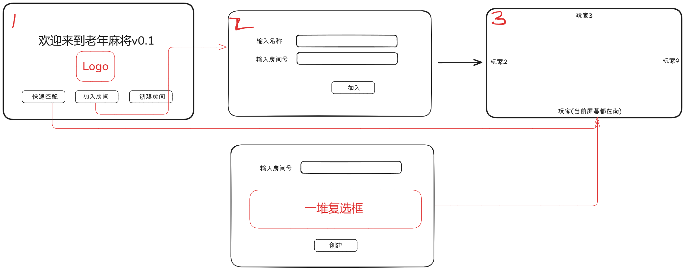

# 四川麻将项目的面向对象设计思想解析

基于Go+Gin+WebSocket的Web四川麻将项目



## 核心设计理念

这个四川麻将项目采用了面向对象编程(OOP)的核心原则，包括封装、继承和多态，同时结合了Go语言的特性和Web应用的架构模式。项目遵循了"单一职责原则"和"关注点分离"的设计思想，使各个模块专注于自己的职责。

## 模型层（Model）

### Player 类

**主体**：代表游戏中的一个玩家实体。

**设计思想**：
- **封装**：将玩家的属性（ID、名称、手牌）和行为（发送消息）封装在一起
- **状态管理**：维护玩家的游戏状态（手牌、分数）
- **通信能力**：通过WebSocket连接提供与前端通信的能力

```go
type Player struct {
    ID    string          // 唯一标识
    Name  string          // 玩家名称
    Conn  *websocket.Conn // WebSocket连接
    Tiles []string        // 玩家手牌
    Score int             // 玩家分数
}
```

### Room 类

**主体**：代表一个麻将游戏房间，是游戏的核心容器。

**设计思想**：
- **聚合关系**：一个房间包含多个玩家（Room与Player是一对多关系）
- **状态机**：通过GameState枚举管理房间的不同状态（等待、游戏中、结束）
- **领域逻辑**：包含麻将游戏的核心规则和逻辑
- **广播机制**：提供向房间内所有玩家或特定玩家发送消息的能力

```go
type Room struct {
    ID                 string    // 房间ID
    Password           string    // 房间密码
    Players            []*Player // 玩家列表
    Owner              *Player   // 房主
    GameState          GameState // 游戏状态
    Tiles              []string  // 牌堆
    DiscardedTiles     []string  // 弃牌堆
    CurrentPlayerIndex int       // 当前玩家索引
    LastPlayedTile     string    // 最后打出的牌
}
```

### Message 类

**主体**：定义WebSocket通信的消息格式。

**设计思想**：
- **数据传输对象(DTO)**：专门用于在系统不同部分之间传递数据
- **类型安全**：通过Type字段区分不同类型的消息
- **灵活性**：使用interface{}类型的Data字段支持不同结构的消息内容

```go
type Message struct {
    Type string      // 消息类型
    Data interface{} // 消息数据
}
```

## 服务层（Service）

### GameManager 类

**主体**：管理所有游戏房间的中央控制器。

**设计思想**：
- **单例模式**：整个应用只需要一个GameManager实例
- **工厂方法**：提供创建房间的方法
- **资源管理**：负责房间的生命周期管理
- **并发控制**：使用互斥锁保护共享资源，确保线程安全

```go
type GameManager struct {
    rooms map[string]*model.Room // 房间映射表
    mutex sync.RWMutex           // 读写锁
}
```

## 控制层（Controller/Handler）

### 各种Handler

**主体**：处理HTTP请求和WebSocket连接的控制器。

**设计思想**：
- **命令模式**：每个Handler处理特定类型的请求
- **依赖注入**：通过参数接收GameManager等依赖
- **中介者模式**：作为前端和后端服务之间的中介
- **责任链模式**：在WebSocket处理中，根据消息类型分发到不同的处理函数

```go
// 函数式编程风格的Handler
func CreateRoomAPIHandler(gameManager *service.GameManager) gin.HandlerFunc {
    // 返回一个闭包，捕获gameManager
    return func(c *gin.Context) {
        // 处理请求逻辑
    }
}
```

## 前端设计

### 页面对象

**主体**：各个HTML页面代表不同的用户界面。

**设计思想**：
- **模板方法模式**：使用HTML模板定义页面结构，通过Go模板引擎注入数据
- **组合模式**：页面由多个组件（玩家列表、游戏区域、聊天区域等）组成

### JavaScript模块

**主体**：负责前端交互逻辑的JavaScript文件。

**设计思想**：
- **观察者模式**：通过WebSocket监听服务器事件，并更新UI
- **命令模式**：将用户操作封装为命令发送给服务器
- **状态模式**：根据游戏状态显示不同的UI元素和启用/禁用不同的操作
- **策略模式**：根据不同的消息类型采用不同的处理策略

```javascript
// 观察者模式的实现
socket.onmessage = function(event) {
    const message = JSON.parse(event.data);
    handleMessage(message); // 根据消息类型分发到不同的处理函数
};

// 命令模式的实现
function playTile() {
    if (isMyTurn && selectedTileIndex !== -1) {
        const tile = myTiles[selectedTileIndex];
        sendMessage('play_tile', { tile: tile });
    }
}
```

## 系统交互设计

### WebSocket通信

**主体**：实时双向通信机制。

**设计思想**：
- **发布-订阅模式**：服务器发布事件，客户端订阅并响应
- **异步通信**：非阻塞式的消息处理
- **事件驱动**：基于事件的编程模型

### HTTP API

**主体**：RESTful风格的HTTP接口。

**设计思想**：
- **资源导向**：API围绕资源（房间、玩家）设计
- **状态转移**：通过HTTP方法表示对资源的操作
- **无状态**：每个请求包含所有必要信息

## 整体架构设计思想

1. **分层架构**：将系统分为模型层、服务层、控制层和视图层，每层有明确的职责

2. **依赖倒置原则**：高层模块不依赖低层模块，两者都依赖抽象

3. **组合优于继承**：通过组合不同的对象实现功能扩展，而非继承

4. **接口隔离原则**：客户端不应依赖它不需要的接口

5. **开闭原则**：对扩展开放，对修改关闭，通过添加新代码而非修改现有代码来实现新功能

## 总结

这个四川麻将项目展示了如何在Web应用中应用面向对象设计原则。通过合理的对象设计和职责划分，项目实现了高内聚、低耦合的架构，使得代码易于理解、维护和扩展。每个模块都有明确的职责和边界，通过定义良好的接口进行交互，体现了面向对象设计的精髓。
